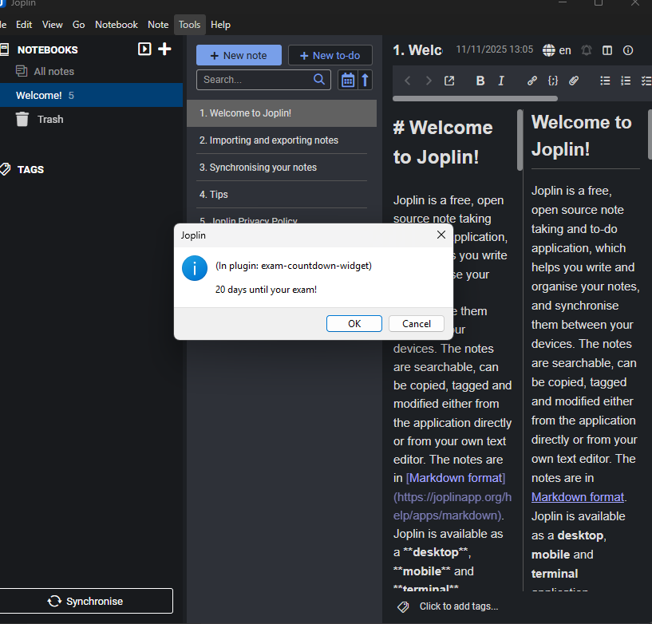

# 📅 Joplin Exam Countdown Widget

A simple Joplin plugin that shows how many days are left until your exam — perfect for students and productivity nerds.

## ✨ Features

- Adds a command to show a countdown to your exam
- Lets you set your exam date in plugin settings
- Displays a friendly dialog with days remaining

## 🛠️ Installation

1. Download the `.jpl` file from the [publish](./publish) folder
2. In Joplin, go to `Tools → Options → Plugins → Install from file`
3. Select the `.jpl` file and restart Joplin

## ⚙️ How to Use

1. Go to `Tools → Options → Exam Countdown`
2. Enter your exam date (format: `YYYY-MM-DD`)
3. Use `Tools → Exam Countdown → Show Exam Countdown` to see how many days are left!

## 📂 Project Structure

- `src/index.ts` – Main plugin logic
- `publish/` – Compiled `.jpl` plugin file
- `.gitignore` – Ignores `node_modules`, `dist`, and `publish`

## 🧠 Author

Made with ❤️ by [@rajanshettirss-afk](https://github.com/rajanshettirss-afk)
